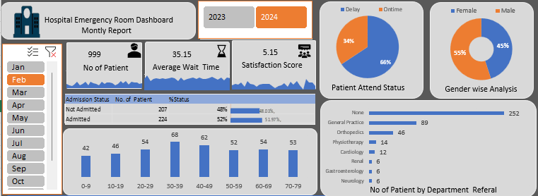

# Hospital-Emergency-Room-Dashboard
Interactive Hospital Emergency Room Dashboard created using Excel for patient and emergency department analysis.

# Hospital Emergency Room Dashboard

An interactive Hospital Emergency Room Dashboard created using Microsoft Excel to analyze patient and emergency department data.

## 📊 Project Overview

This project focuses on analyzing hospital emergency room data and presenting important insights through an interactive Excel dashboard.

The dashboard helps understand:
- Patient volume and trends
- Average waiting time
- Patient satisfaction
- Daily emergency room activity
- Emergency department performance

## 🛠️ Tools Used

- Microsoft Excel
- Pivot Tables
- Charts & Visualizations
- Data Analysis

## 📁 Files Included

- `Hospital Emergency Room Data.csv` – Original/raw dataset
- `Hospital_Emergency_Room_Dashboard.xlsx` – Excel dashboard and analysis
- `hospital_emergency_dashboard.png.png` – Dashboard screenshot

## 📸 Dashboard Preview

## 🎯 Key Objective

The main objective of this project is to transform raw hospital emergency room data into meaningful insights using Excel and create an easy-to-understand dashboard for analysis and decision-making.

## 👨‍💻 Author

**Rishu Raj**

B.Tech Student | Aspiring Data Scientist
